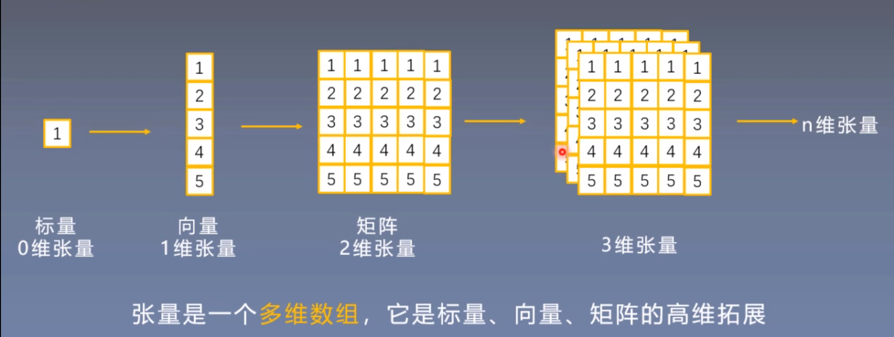

# Tensor

## 一、张量(Tensor)

张量是一个**多维数组**，它是标量(scalar)，向量(vector)，矩阵(matrix)的高维拓展。




## 二、Tensor与Variable

原先Variable是torch.autograd中的数据类型，主要用于封装Tensor，进行**自动求导**，现在Variable已经加入到Tensor中了。当然还是有必要了解Variable的。

Variable类型数据包含的属性：

+ data : 被包装的Tensor。
+ grad：data的梯度。
+ grad_fn：创建Tensor的Function，是应用链式法则反向传播进行自动求导的关键。
+ requires_grad：指示是否需要梯度。
+ is_leaf：指示是否是叶子节点(张量)。

> **简单来说，Variable在Tensor的基础上增加了四个属性用于自动求导。**

然后，在Pytorch 0.4.0之后Variable就被加入Tensor中了，所以，现在的torch.Tensor除了Variable中的属性，还有如下属性：

+ **dtype: 张量的数据类型**，如torch.int32. torch.int64, torch.float32, torch.float64等。(**一般勇2位浮点数。**)
+ **shape： 张量的形状**，如$(64,3,224,224)$。
+ **device：张量所在设备**，GPU/CPU，是加速计算的关键。


> 现在的torch.Tensor有八个主要属性，其中4个与数据本身相关，4个与梯度、求导相关。


## 三、Tensor的创建

Tensor的创建方法可以访问Pytorch官网的[Tensor Creation Ops](https://pytorch.org/docs/stable/torch.html#creation-ops )。

### 1.直接创建

#### (1) torch.tensor()

```python
torch.tensor(data, *, dtype=None, device=None, requires_grad=False, pin_memory=False) -> Tensor
"""
Parameters:
data (array_like) – tensor的初始化数据. 可以是list,NumPy ndarray, scalar.
如果是元组的话则是表示创建的张量的shape。

Keyword Arguments:
dtype (torch.dtype, optional) – the desired data type of returned tensor. Default: if None, infers data type from data.

device (torch.device, optional) – the desired device of returned tensor. Default: if None, uses the current device for the default tensor type (see torch.set_default_tensor_type()). device will be the CPU for CPU tensor types and the current CUDA device for CUDA tensor types.

requires_grad (bool, optional) – If autograd should record operations on the returned tensor. Default: False. 即张量是否可以用于自动求导。

pin_memory (bool, optional) – If set, returned tensor would be allocated in the pinned memory. Works only for CPU tensors. Default: False. 张量是否存于锁页内存。
"""
```

#### (2) torch.from_numpy()

```python
torch.from_numpy(ndarray) -> Tensor
"""
Creates a :class:`Tensor` from a :class:`numpy.ndarray`.

The returned tensor and :attr:`ndarray` share the same memory. Modifications to the tensor will be reflected in the :attr:`ndarray` and vice versa. The returned tensor is not resizable.
"""                                   
```

需要注意的是，从torch.from_numpy创建的张量和原来的ndarray共享内存，其中一个修改了另一个也会个被修改。

实例代码如下：

```python
#!/usr/bin/env python
# coding=utf-8

import torch
import numpy as np

a = [i for i in range(10)]
b = np.array(a)
c = torch.tensor(a)
d = torch.tensor(b)
e = torch.from_numpy(b)

print(a)
print(b)
print(c)
print(d)
print(e)

b[0] = 100
print(b)
print(d)
print(e)
```


### 2.依据数值创建

#### (1) torch.zeros()： 创建数值全为0的张量

```python
torch.zeros(*size, *, out=None, dtype=None, layout=torch.strided, device=None, requires_grad=False) -> Tensor
"""
Returns a tensor filled with the scalar value `0`, with the shape defined
by the variable argument :attr:`size`.

Args:
    size (int...): a sequence of integers defining the shape of the output tensor.Can be a variable number of arguments or a collection like a list or tuple.

Keyword args:
    out (Tensor, optional): the output tensor. 这里的out和返回的tensor是同一个tensor，两者地址相同。
    
    dtype (:class:`torch.dtype`, optional): the desired data type of returned tensor.Default: if ``None``, uses a global default (see :func:`torch.set_default_tensor_type`).
    
    layout (:class:`torch.layout`, optional): the desired layout of returned Tensor.Default: ``torch.strided``.
    
    device (:class:`torch.device`, optional): the desired device of returned tensor.Default: if ``None``, uses the current device for the default tensor type(see :func:`torch.set_default_tensor_type`). :attr:`device` will be the CPU for CPU tensor types and the current CUDA device for CUDA tensor types.
    
     requires_grad (bool, optional): If autograd should record operations on the returned tensor. Default: ``False``.
"""
```

**张量形状(size)为了统一，全部使用tuple为传入参数类型。**

#### (2) torch.zeros_like()

```python
torch.zeros_like(input, *, dtype=None, layout=None, device=None, requires_grad=False, memory_format=torch.preserve_format) -> Tensor
```

创建和input形状一样的所有数据元素为0的张量。

#### (3) torch.ones()，torch.ones_like(), torch.full(), torch.full_like()

和torch.zeros(), torch.zeros_like()一样。

#### (4)其他数值创建方法

torch.arrange()用于创建等差数列的一维张量， torch.linspace()用于创建均分的一维张量. torch.logspace()，用于创建一个对数均分的一维张量，torch.eyes()用于创建单位对角矩阵。


### 3.依概率分布创建张量

#### (1) torch.normal()

torch.normal()生成概率分布符合**正态分布**的张量。

```python
torch.normal(mean, std, *, generator=None, out=None) -> Tensor
"""
Args:
 	mean : 均值，可以是张量，标量
 	std  : 标准差，可以是张量、标量
 	
(1) mean 为张量， std 为张量， [N(mean[i], std[i]) for i in range(len(mean))]，要求mean，std长度相等。
(2) mean 为标量， std 为标量， N(mean, std), 还需要指定size，即生成的张量的长度。
(3) mean 为张量， std 为标量， N(mean[i], std)
(4) mean 为标量， std 为张量， N(mean, std[i])
"""
```

### (2) torch.randn(), torch.randn_like()

创建符合**标准正态分布**的张量。

>torch.rand(), torch.rand_like(): 在[0, 1)上，生成**均匀分布**。
>
>torch.randint(), torch.randint_like()： 在[low, high)生成整数均匀分布。
>
>torch.randperm()：生成从0-(n - 1)的**随机排列**。
>
>torch.bernouli()： 传入input参数为概率，生成**伯努利分布**。