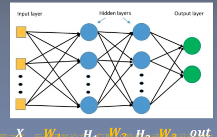

# 权值初始化

## 一、梯度消失与爆炸(Gradient Vanishing and Exploding)

两层全连接神经网络+Loss函数：$H_2=H_1\times W_2,out=f(H_2),Loss=g(out)$。则：
$$
\frac{\partial Loss}{\part W_2}=\frac{\part Loss}{\part out}\times\frac{\part out}{\part H_2}\times\frac{\part H_2}{\part W_2}\\
=\frac{\part Loss}{\part out}\times\frac{\part out}{\part H_2}\times H_1
$$
**梯度消失**：$H_1\rightarrow 0$，$\frac{\part Loss}{\part W_2}\rightarrow 0$。

**梯度爆炸**：$H_1\rightarrow\infty,\frac{\part Loss}{\part W_2}\rightarrow \infty$。

> 其实通过30来层全连接层计算均值与标准差就可以试出来了。


## 二、方差一致性

首先要明确，**==梯度爆炸、梯度消失是在反向传播过程中发生的，不过必然是受到前向传播的影响的。==**可以先考虑前向传播，因为反向传播基本与前向传播一致。即$H_1$过大实际上是**数据分布不均匀，即方差过大**，如果能**让方差变小，那么可以有效地避免梯度爆炸的情况**。

**首先考虑没有激活函数的情况，即考虑全连接层**，因为$H_2=H_1\times W_2$，通过计算随机变量乘积的方差后进行优化：

假设随机变量X，Y独立(X代表$H_1$，Y代表$W_2$)，那么：

+ $E(X\cdot Y)=E(X)\cdot E(Y)$.
+ $D(X)=E(X^2)-E(X)^2$.
+ $D(X+Y)=D(X)+D(Y)+Cov(X,Y)=D(X)+D(Y)$.

则两个独立随机变量X，Y乘积的方差为：
$$
D(X\cdot Y)=E(X^2Y^2)-E(XY)^2\\
=E(X^2)E(Y^2)-E(X)^2E(Y)^2\\
=[D(X)+E(X)^2][D(Y)+E(Y^2)]-E(X)^2E(Y)^2\\
=D(X)D(Y)+D(X)E(Y)^2+D(Y)E(X)^2
$$
假设$D(X),D(Y)$都具有较小的方差值，那么重点在于对$E(X),E(Y)$的处理了。我们已经知道了X，Y的分布，那么我们可以调整X,Y的分布为标准正态分布，$D(X)=D(Y)=1,E(X)=E(Y)=0$，这样：$D(XY)=D(X)D(Y)$。

下面是一张全连接层的图片：



对于全连接层，假设有n个节点，那么：$H_{1i}=\sum_{i=1}^nX_i\cdot W_{1i}$，则：
$$
D(H_{1})=\sum_{i=1}^nD(X_i)D(W_{1i})=n\times(1\times1)=n\\
std(H_{1})=\sqrt{D(H_1))}=\sqrt{n}
$$
**显然，==如果不对权重进行调整的话，全连接层越多，方差就会越大，造成梯度爆炸==。**

那么此时$W_{1i}$就不能服从方差为1，均值为0的分布了，我们要让方差不会变太大，就需要让$D(H_1)=D(H_2)=...=D(H_n)=1$，因此，权值的分布需要进行改动：
$$
D(W_{1i})=\frac{1}{n}\Rightarrow std(W_{1i})=\sqrt{\frac{1}{n}}
$$
以上是没有考虑激活函数的情况，如果使用激活函数$Sigmoid, Tanh$这种saturate activation function，**会产生梯度消失的现象，因为一旦进入饱和区域，数据变化极小，梯度接近0，因此需要下面的Xavier初始化方法。**


## 三、Xavier初始化方法—解决饱和激活函数的梯度消失问题

1. **方差一致性**：保持数据尺度维持在恰当的范围内，通常方差为1。
2. **激活函数：饱和函数，如Sigmoid，Tanh。**

假设第i层有$n_i$个节点，**同时考虑前向传播和反向传播**，要使：
$$
n_i\times D(W)=1\\
n_{i+1}\times D(W)=1\\
\Rightarrow D(W)=\frac{2}{n_i+n_{i+1}}
$$
论文中Xavier初始化方法假设W服从均值为0的均匀分布，即$W\sim U[-a,a],a>0$，那么：
$$
D(W)=\frac{(a-(-a))^2}{12}=\frac{a^2}{3}=\frac{2}{n_i+n_{i+1}}\\
\Rightarrow a=\frac{\sqrt{6}}{\sqrt{n_i+n_{i+1}}}\\
\Rightarrow W\sim U[-\frac{\sqrt{6}}{\sqrt{n_i+n_{i+1}}},\frac{\sqrt{6}}{\sqrt{n_i+n_{i+1}}}]
$$
Xavier解决了饱和函数的梯度消失问题，但是却会引起非饱和函数，如ReLU及其变种的梯度爆炸，因此有了Kaiming初始化方法。


## 四、Kaiming初始化方法—解决非饱和激活函数的梯度爆炸问题

1. **方差一致性**：保持数据尺度维持在恰当范围，通常方差为1。

2. **激活函数**：ReLU及其变种。

3. **针对ReLU函数**：$D(W)=\frac{2}{n_i}$，推理过程看论文。

   **针对ReLU函数的变种，设其在负半轴斜率为a**: $D(W)=\frac{2}{(1+a^2)n_i}$。即：
   $$
   D(W)=\frac{2}{(1+a^2)n_i}\\
   std(W)=\sqrt{\frac{2}{(1+a^2)n_i}}
   $$
   

## 五、Pytorch中常用的初始化方法

1. Xavier均匀分布。
2. Xavier正态分布。
3. Kaiming均匀分布。
4. Kaiming正态分布。
5. 均匀分布。
6. 正态分布。
7. 常数分布。
8. 正交矩阵初始化。
9. 单位矩阵初始化。
10. 稀疏矩阵初始化。

> **计算非线性激活函数的方差变化尺度的函数：`torch.nn.init.calculate_gain()`**。
>
> ```python
> def calculate_gain(nonlinearity, param=None):
>     r"""Return the recommended gain value for the given nonlinearity function.
>     The values are as follows:
> 
>     ================= ====================================================
>     nonlinearity      gain
>     ================= ====================================================
>     Linear / Identity :math:`1`
>     Conv{1,2,3}D      :math:`1`
>     Sigmoid           :math:`1`
>     Tanh              :math:`\frac{5}{3}`
>     ReLU              :math:`\sqrt{2}`
>     Leaky Relu        :math:`\sqrt{\frac{2}{1 + \text{negative\_slope}^2}}`
>     ================= ====================================================
> 
>     Args:
>         nonlinearity: the non-linear function (`nn.functional` name)
>         param: optional parameter for the non-linear function
> 
>     Examples:
>         >>> gain = nn.init.calculate_gain('leaky_relu', 0.2)  # leaky_relu with negative_slope=0.2
>     """
> ```
>
> 只能用于pytorch实现的激活函数的方差变化尺度的计算。

